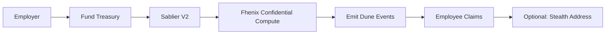

# RIAD Finance

**Confidential Real-Time Payroll on Arbitrum — Privacy-Preserving with Streaming Settlement**

[Problem](#the-problem) • [Market](#market-opportunity) • [Competitors](#competitive-landscape) • [Tech Stack](#tech-stack) • [Architecture](#architecture) • [Features](#features) • [Getting Started](#getting-started)

*RIAD Finance — Confidential, real-time payroll infrastructure on EVM Layer 2 networks (Arbitrum, Robinhood Chain, and more).*

---

## Overview

RIAD Finance is a confidential, real-time salary streaming protocol on Arbitrum (EVM). Employers fund a private treasury, add employees with per-second salary rates, and salaries accrue autonomously via Sablier V2 LockupLinear streams. Sensitive employee compensation metrics are processed through Fhenix's confidential co-processor to keep individual salary amounts hidden from public block explorers. Employees can view their live earnings and withdraw — all with cryptographic privacy guarantees.

RIAD Finance leverages a modern EVM stack optimized for privacy and efficiency:

1. The employer deposits funds into a treasury and initiates a Sablier V2 stream for each employee.
2. Sensitive salary metrics (individual rates, totals) are encrypted and processed through Fhenix for confidential computation.
3. Events are emitted in Dune-compatible format for analytics indexing and compliance.
4. Employees claim streams directly, with optional stealth address integration (Umbra Protocol) for payment privacy.



---

## The Problem

### Salary Transparency Destroys Companies From the Inside
On a public blockchain, every salary is visible. When employees discover compensation gaps — even justified ones — it breeds resentment and attrition.
- Employee A discovers Employee B earns 30% more. Morale collapses.
- Top performers leave when they learn junior hires negotiated higher.
- Private bonuses become public knowledge. Everyone expects one.
- Every raise is visible — compensation becomes office gossip.

### Outsiders Can Read Your Entire Payroll
- Competitors see your burn rate and poach talent by outbidding exact salaries.
- Investors reverse-engineer your runway from payment flows.
- Bad actors identify high earners and target them.
- Every payout creates a permanent employer-to-employee link on-chain.

### Workers Earn Every Second But Get Paid Every 30 Days
Traditional payroll forces a 30-day liquidity gap. Workers generate value from minute one but only access earnings weeks later. Cross-border teams wait 3–5 days for SWIFT settlements, losing 3–7% to fees and FX spreads.

---

## Market Opportunity

The on-chain payroll market is accelerating as crypto compensation goes mainstream.

**Why now:** By 2026, stablecoin payroll has crossed the early-adopter chasm. Regulatory clarity is improving, enterprise blockchain adoption is maturing, and Gen-Z workforce expectations are shifting toward real-time, crypto-native compensation. Yet no major protocol offers true salary privacy — until RIAD Finance.

| Segment | Size | Pain Point |
|---------|------|------------|
| **Crypto-native companies** | 50,000+ globally | Every salary is public on-chain, exposing org charts. |
| **Remote-first teams** | 70M+ workers | 3–7% cross-border fees, 3–5 day settlement waits. |
| **Freelancer platforms** | $1.5T gig economy | 30-day payment gaps, high platform lock-in. |
| **DAOs & treasuries** | $25B+ managed | No privacy tooling for contributor payments. |

---

## Competitive Landscape

RIAD Finance is the only protocol that combines stealth address privacy, per-second streaming, and private settlement. Here is how we compare:

| Protocol | Streaming | Privacy | Settlement | Chain |
|----------|-----------|---------|------------|-------|
| **Superfluid / Sablier** | Per-second | None — all public | Public transfers | EVM (Arbitrum, Mainnet) |
| **Zebec / Streamflow** | Per-second | None — all public | Public transfers | Solana |
| **RIAD Finance** | Per-second | Stealth Address Privacy | Stealth Payments | EVM (Arbitrum) |

- **Superfluid / Sablier:** Great streaming primitives, but all salary data is fully public on-chain. Any explorer can see who pays whom and how much. No privacy at all.
- **Zebec / Streamflow:** Great Solana streaming, but focus on TradFi compliance. Salaries are still transparent on-chain, relying heavily on centralized infrastructure.
- **RIAD Finance:** The privacy-first payroll protocol. Stealth addresses mean even the employer-employee link is obscured. Sensitive employee metadata is processed privately.

---

## Go-to-Market Strategy

### Phase 1 — Web3 Startups & DAOs (Now)
- **Why first:** Treasuries are already on-chain, teams are crypto-native, immediate product-market fit.
- **Wedge:** "Your contributor salaries are public right now — competitors can see your entire org chart and burn rate."
- **Distribution:** Arbitrum L2 ecosystem partnerships, hackathon demos, developer content, DAO governance proposals.

### Phase 2 — Remote-First Companies (Next)
- **Why:** 70M+ global remote workers, cross-border payroll is painful.
- **Wedge:** "Pay your global team in seconds for <$0.01 per transaction — no SWIFT, no intermediaries."
- **Distribution:** HR/payroll platform integrations, stablecoin on-ramp partnerships.

---

## Architecture

RIAD Finance uses a hybrid state model: On-chain Solidity contracts handle stream creation and treasury deposits, cryptographic stealth addresses shield employee addresses, and a MongoDB backend indexes metadata for rapid UI rendering.

### High-Level System Architecture

```text
┌─────────────────────────────────────────────────────────────────┐
│                        FRONTEND (Next.js 16)                    │
│                                                                 │
│  ┌──────────────┐  ┌──────────────┐  ┌──────────────────────┐  │
│  │   Employer   │  │   Employee   │  │     Treasury         │  │
│  │  Dashboard   │  │    Portal    │  │   Management         │  │
│  └──────┬───────┘  └──────┬───────┘  └──────────┬───────────┘  │
│         │                 │                      │              │
│  ┌──────┴─────────────────┴──────────────────────┴───────────┐  │
│  │       Wallet Adapter (RainbowKit / Wagmi / Viem)           │  │
│  └──────────────────────────┬────────────────────────────────┘  │
│                             │  Signed Requests / Sessions       │
│  ┌──────────────────────────┴────────────────────────────────┐  │
│  │            Next.js API Routes (14 route groups)            │  │
│  │  /api/payroll · /api/employees · /api/streams · /api/auth  │  │
│  └──────────────────────────┬────────────────────────────────┘  │
└──────────────────────────────┼──────────────────────────────────┘
                               │
           ┌───────────────────┴───────────────────┐
           │            ARBITRUM SEPOLIA           │
           │                                       │
           │  ┌─────────────────────────────────┐  │
           │  │    RIADFinancePayroll Contract  │  │
           │  │    USDC/WETH Streaming Logic    │  │
           │  └───────────────┬─────────────────┘  │
           │                  │                    │
           │                  ▼                    │
           │  ┌─────────────────────────────────┐  │
           │  │     Sablier V2 LockupLinear     │  │
           │  │     Real-Time Stream Engine     │  │
           │  └─────────────────────────────────┘  │
           │                                       │
           └───────────────────────────────────────┘
```

---

## Security Model

- **Wallet-based Authentication:** Every API request is authenticated via wallet signatures. The client signs a structured message (`wallet`, `method`, `path`, `timestamp`, `bodySha256`). The server verifies against the claimed wallet's public key to issue a session.
- **Company Key Vault:** Treasury and settlement authority keypairs are encrypted at rest using AES-256-GCM with a server-side encryption secret. Keys never leave the server in plaintext.
- **Stealth Address Generator (Umbra Protocol)**: Direct private payroll transfers generate a one-time stealth destination address for the employee, breaking the public link between the company treasury and the worker’s main wallet.

---

## Getting Started

### Prerequisites
- Node.js 18+
- Foundry (Forge)
- MongoDB (Atlas or local)

### 1. Install Dependencies
```bash
git clone https://github.com/shumhn/riad-finance.git
cd riad-finance
npm install
```

### 2. Configure Environment
```bash
cp .env.example .env
```
Fill in the required values (MongoDB URI, RPC endpoints, contract addresses).

### 3. Build & Test Contracts
```bash
# Build contracts
npm run contracts:build

# Run contract tests
npm run contracts:test
```

### 4. Run Frontend
```bash
npm run dev
```
Open `http://localhost:3000` to access the dashboard.
